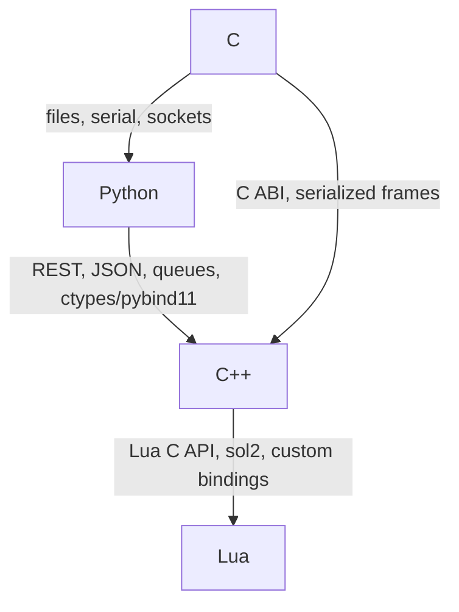

# Interoperability Map

```mermaid
flowchart TD
  Py[Python] -->|REST, JSON, queues, ctypes/pybind11| Cpp[C++]
  Cpp -->|Lua C API, sol2, custom bindings| Lua[Lua]
  C[C] -->|C ABI, serialized frames| Cpp
  C -->|files, serial, sockets| Py
```

Prefer stable data contracts over sharing memory. Use direct calls only inside one process with clear ownership and tests.
