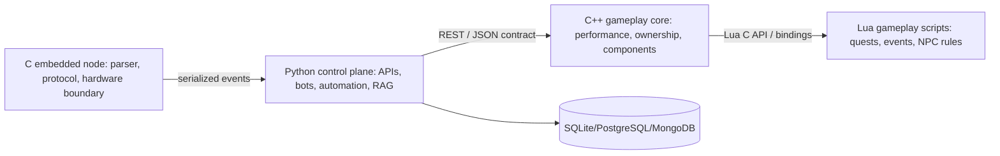

# Codex Second Brain for Python, C, Lua, and C++

Status: CREATED. This repository contains an English, RAG-friendly technical second brain for learning, reference, and production engineering across Python, C, Lua, and modern C++.

## Use cases

- Build Discord bots, Flask APIs, automation, RAG ingestion pipelines, and robust API clients with Python.
- Build embedded-style parsers, protocol state machines, and memory-safe C modules.
- Build Lua gameplay scripts, quests, event rules, and safe scripting sandboxes.
- Build C++ gameplay cores, RAII-based modules, event buses, and Unreal-adjacent architecture.

## Start here

1. Read [mission and scope](00-system/mission-and-scope.md).
2. Use [navigation](00-system/navigation.md) to find the right document.
3. Pick a learning track from [learning roadmap](00-system/learning-roadmap.md).
4. Use [definition of done](00-system/definition-of-done.md) before claiming a module is production ready.

## Architecture map

## Status labels

- CREATED: file or section was created.
- UPDATED: existing content was changed.
- VERIFIED: a check was actually run.
- NOT VERIFIED: content is designed but not executed.
- BLOCKED: verification could not be completed.
- RECOMMENDED NEXT STEP: future work.
